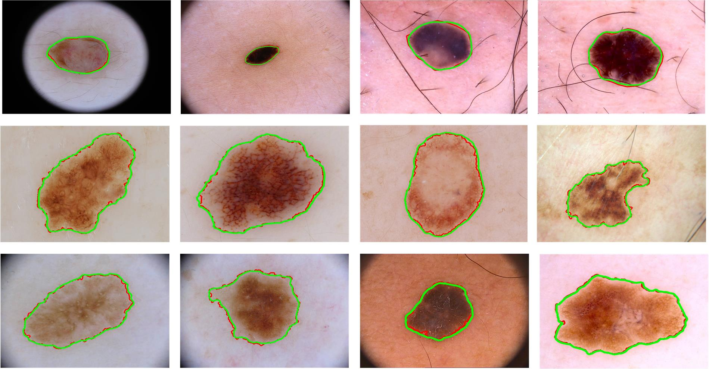

# LCASA-Net.pytorch(Not available now.)
A Light-weight Context-Aware Self-Attention model for Skin Lesion Segmentation

## Abstract
This is a pytorch implementation of [LCASA-Net: A Light-weight Context-Aware Self-Attention model for Skin Lesion Segmentation](), which applies Context-Aware Self-Attention block to effectively and efficiently capture informative features in dermoscopic images. Our model is created specifically for skin lesion segmentation task requiring low latency operation with higher precision. LCASA-Net provides better accuracy to existing state-of-the-art methods on ISBI 2016 and ISBI 2017 datasets.        


## [ISBI 2017](https://challenge.kitware.com/#challenges) test results      


## Comparison 
**Part of the results are from [ISBI 2016 and ISBI 2017](https://challenge.kitware.com/#challenges) DATASETS.**
### RESULT1 - ISBI 2016
| Approaches | Accuracy | Dice_coefficient | Jaccard_index | 
|--------------|:---:|:---:|:---:|
|[CUMED](https://challenge.kitware.com/#phase/566744dccad3a56fac786787)|0.949|0.897|0.829|
|[EXB](https://challenge.kitware.com/#phase/566744dccad3a56fac786787)|0.953|0.910|0.843| 
|[Mahmudur](https://challenge.kitware.com/#phase/566744dccad3a56fac786787)|0.952|0.895|0.822|
|[SFU-mial](https://challenge.kitware.com/#phase/566744dccad3a56fac786787)|0.944|0.885|0.811|
|[UiT-Seg](https://challenge.kitware.com/#phase/566744dccad3a56fac786787)|0.939|0.881|0.806|
|[DCDN](https://ieeexplore.ieee.org/abstract/document/8545136/)|0.959|0.930|0.869|
|[LCASA-Net]()|0.976|0.954|0.915|


### RESULT2 - ISBI 2017
| Approaches | Accuracy | Dice_coefficient | Jaccard_index | 
|------------|:---:|:---:|:---:|
|[RECOD](https://arxiv.org/abs/1703.04819)|0.931|0.839|0.754|
|[ResNet](https://arxiv.org/abs/1703.04197)|0.934|0.842|0.758| 
|[SMCP](http://eprints.whiterose.ac.uk/116480/)|0.930|0.839|0.749|
|[FCN](https://www.cv-foundation.org/openaccess/content_cvpr_2015/html/Long_Fully_Convolutional_Networks_2015_CVPR_paper.html)|0.930|0.837|0.752|
|[TECNALIA](https://arxiv.org/abs/1703.03702)|0.922|0.810|0.718|
|[DCDN](https://ieeexplore.ieee.org/abstract/document/8545136/)|0.938|0.845|0.760|
|[MtSinai](https://ieeexplore.ieee.org/abstract/document/8239798/)|0.934|0.849|0.765|
|[Enet](https://arxiv.org/abs/1606.02147)|0.929|0.827|0.741|
|[LCASA-Net]()|0.947|0.879|0.809|

## Requirements
1、cuda9.0     
2、python3.6        
3、[opencv(cv2)](https://pypi.org/project/opencv-python/)        
4、tensorboardX           
5、pytorch >= 1.0.1        

## Data Prepare
please download the datasets of [ISBI 2016 and ISBI 2017](https://challenge.kitware.com/#challenges).        

## Compile
```  
cd $PATH_ROOT/networks/libs/
./build.sh
```

## Eval
If you do not wish to train the model, you can download [our pre-trained model]() and save it in `$PATH_ROOT/snapshots`.

```  
python evaluate.py --data_dir='/PATH/TO/ISBI/IMAGES/' 
               --restore_from=''/snapshots/your_pretrained_model.pth'
               --gpu='0'
```

## Train
```  
cd $PATH_ROOT/tools
python train.py --data_dir='/PATH/TO/ISBI/' 
                --gpu='0'
```

## Tensorboard
```  
cd $PATH_ROOT/snapshots
tensorboard --logdir=.
``` 

